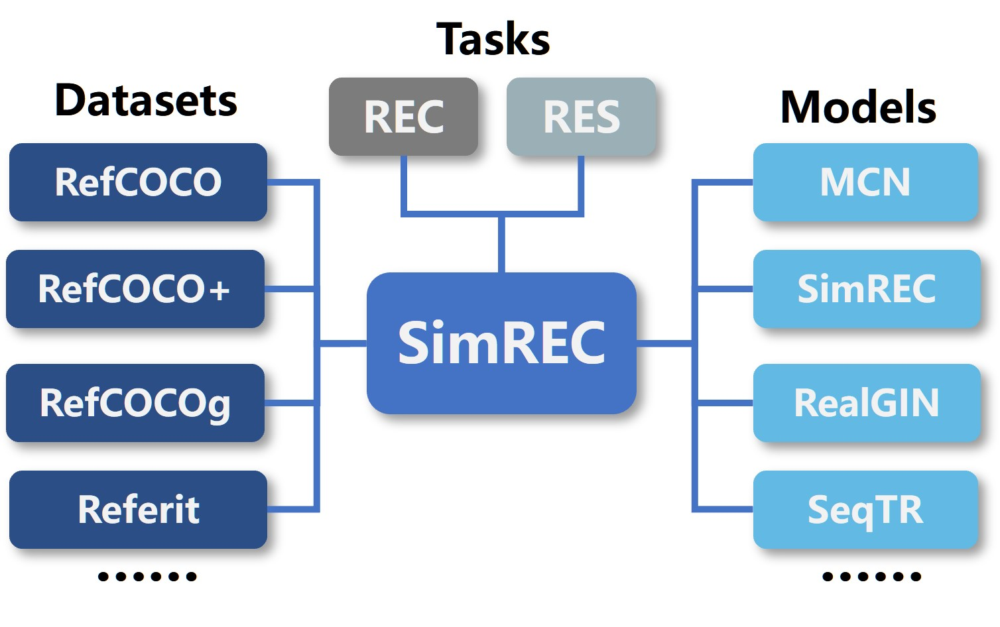

# SimREC

[](https://www.python.org/)

[](https://mac.xmu.edu.cn/)

SimREC is a simple and lightweight codebase for the research of referring expression comprehension and segmentation, with  supporting large-scale pre-training and multi-task learning.   SimREC includes official implementation for our paper  "[Multi-task Collaborative Network for Joint Referring Expression Comprehension and Segmentation](https://openaccess.thecvf.com/content_CVPR_2020/papers/Luo_Multi-Task_Collaborative_Network_for_Joint_Referring_Expression_Comprehension_and_Segmentation_CVPR_2020_paper.pdf)" and  "[What Goes beyond Multi-modal Fusion in One-stage Referring Expression Comprehension: An Empirical Study](https://arxiv.org/pdf/2204.07913.pdf)" .  More models will be updated. 


<p align="center">
	
</p>


## Updates
- (2022/4/20) A novel point-based prediction paradigm [SeqTR](https://arxiv.org/abs/2203.16265) is released in [here](https://github.com/sean-zhuh/SeqTR), which will be updated in this repository soon.
- (2022/4/20) Implement MCN for SimREC project.
- (2022/4/19) Release our SimREC project.
## Installation
```
pip install -r requirements.txt
wget https://github.com/explosion/spacy-models/releases/download/en_vectors_web_lg-2.1.0/en_vectors_web_lg-2.1.0.tar.gz -O en_vectors_web_lg-2.1.0.tar.gz
pip install en_vectors_web_lg-2.1.0.tar.gz
```
## Data preparation

-  Follow the instructions of  [DATA_PRE_README.md](https://github.com/luogen1996/SimREC/blob/main/DATA_PRE_README.md) to generate training data and testing data.
-  Download the pretrained weights of backbone (vgg, darknet, cspdarknet, DResNet, etc.).  Expect for DResNet, all pretrained backbones are trained  on COCO 2014 *train+val*  set while removing the images appeared in the *val+test* sets of RefCOCO, RefCOCO+ and RefCOCOg (nearly 6500 images).  Please follow the instructions of  [DATA_PRE_README.md](https://github.com/luogen1996/SimREC/blob/main/DATA_PRE_README.md) to download them.

## Training and Evaluation 

1. Preparing your settings. To train a model, you should  modify ``./config/config.yaml``  to adjust the settings  you want. 
2. Training the model. run ` train.py`  under the main folder to start training:
```
python train.py --config ./config/config.yaml
```
3. Testing the model.   Then, you can run ` test.py`  by
```
python test.py --eval-weights ./logs/simrec/1/weights/det_best.pth
```
4. Training log.  Logs are stored in ``./logs`` directory, which records the detailed training curve and accuracy per epoch. If you want to log the visualizations, please  set  ``LOG_IMAGE`` to ``True`` in ``config.yaml``.   

## Model Zoo
SimREC supports all benchmarks of REC and RES, and  can easily achieve  very competitive performance.  More results  are available  in [Model Zoo](https://github.com/luogen1996/SimREC/blob/main/MODEL_ZOO.md).

|  Tasks  | RefCOCO | RefCOCO+ | RefCOCOg | Referit | Flickr | All REC data + VG (0.2M) |
| :-----: | :-----: | :------: | :------: | :-----: | :----: | :----------------------: |
|   REC   |    ✓    |    ✓     |    ✓     |    ✓    |   ✓    |            ✓             |
|   RES   |    ✓    |    ✓     |    ✓     |    ✓    |   ×    |            ×             |
| REC+RES |    ✓    |    ✓     |    ✓     |    ✓    |   ×    |            ×             |

## Citation

If this repository is helpful for your research, or you want to refer the provided results in your paper, you can cite the corresponding paper:
```
@article{luo2022what,
  title={What Goes beyond Multi-modal Fusion in One-stage Referring Expression Comprehension: An Empirical Study},
  author={Luo, Gen and Zhou, Yiyi and Sun, Jiamu and Huang, Shubin and Sun, Xiaoshuai and Ye, Qixiang and Wu, Yongjian and Ji, Rongrong},
  journal={arXiv preprint arXiv:2204.07913},
  year={2022}
}
```
```
@article{zhu2022seqtr,
  title={SeqTR: A Simple yet Universal Network for Visual Grounding},
  author={Zhu, Chaoyang and Zhou, Yiyi and Shen, Yunhang and Luo, Gen and Pan, Xingjia and Lin, Mingbao and Chen, Chao and Cao, Liujuan and Sun, Xiaoshuai and Ji, Rongrong},
  journal={arXiv preprint arXiv:2203.16265},
  year={2022}
}
```
```
@InProceedings{Luo_2020_CVPR,
author = {Luo, Gen and Zhou, Yiyi and Sun, Xiaoshuai and Cao, Liujuan and Wu, Chenglin and Deng, Cheng and Ji, Rongrong},
title = {Multi-Task Collaborative Network for Joint Referring Expression Comprehension and Segmentation},
booktitle = {Proceedings of the IEEE/CVF Conference on Computer Vision and Pattern Recognition (CVPR)},
month = {June},
year = {2020}
}
```
```
@inproceedings{luo2020cascade,
  title={Cascade grouped attention network for referring expression segmentation},
  author={Luo, Gen and Zhou, Yiyi and Ji, Rongrong and Sun, Xiaoshuai and Su, Jinsong and Lin, Chia-Wen and Tian, Qi},
  booktitle={Proceedings of the 28th ACM International Conference on Multimedia},
  pages={1274--1282},
  year={2020}
}
```
```
@article{zhou2021real,
  title={A real-time global inference network for one-stage referring expression comprehension},
  author={Zhou, Yiyi and Ji, Rongrong and Luo, Gen and Sun, Xiaoshuai and Su, Jinsong and Ding, Xinghao and Lin, Chia-Wen and Tian, Qi},
  journal={IEEE Transactions on Neural Networks and Learning Systems},
  year={2021},
  publisher={IEEE}
}
```
## Acknowledgement

 Thanks for a lot of codes from  [OpenVQA](https://github.com/MILVLG/openvqa).

